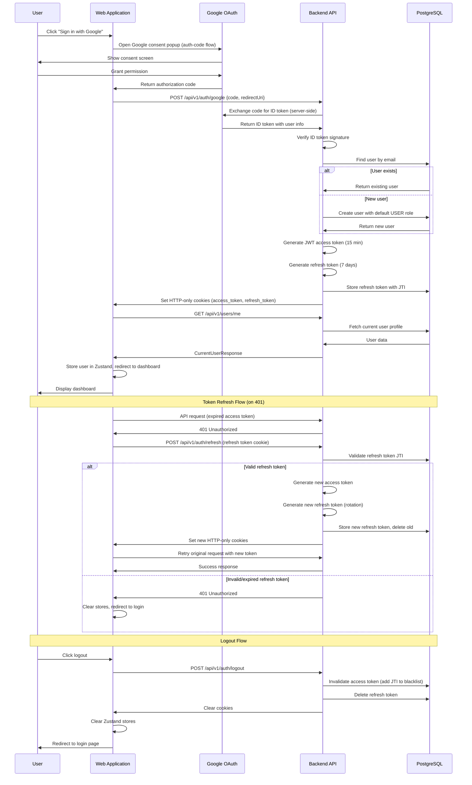

# Authentication Flow

## Sequence Diagram

## Flow Description

1. **Google Sign-In Initiation** - User clicks the Google sign-in button, which opens a Google consent popup using the `@react-oauth/google` library with auth-code flow.

2. **Authorization Code Grant** - After the user grants permission, Google returns an authorization code to the frontend (not an ID token directly, for security).

3. **Server-Side Token Exchange** - The frontend sends the authorization code and redirect URI to `POST /api/v1/auth/google`. The backend securely exchanges this code with Google's servers for an ID token containing the user's email and name.

4. **User Resolution** - The backend looks up the user by email. If the user doesn't exist, a new account is created with the default `USER` role and linked to a default team.

5. **JWT Token Generation** - The backend generates a JWT access token (15-minute expiry, contains userId, role, JTI) and a refresh token (7-day expiry). The refresh token is persisted in the `refresh_tokens` table.

6. **Secure Cookie Delivery** - Both tokens are set as HTTP-only cookies (secure + SameSite in production). This prevents XSS attacks from accessing tokens via JavaScript.

7. **User Profile Fetch** - The frontend immediately calls `GET /api/v1/users/me` to get the full user profile, stores it in the Zustand user store, and redirects to the dashboard.

8. **Transparent Token Refresh** - When the access token expires, the Axios interceptor catches the 401 response, calls the refresh endpoint, and retries the original request. A single-flight pattern prevents concurrent refresh races.

9. **Logout** - On logout, the backend invalidates the access token by adding its JTI to a blacklist table, deletes the refresh token, and clears the cookies. The frontend clears all Zustand stores and redirects to login.
