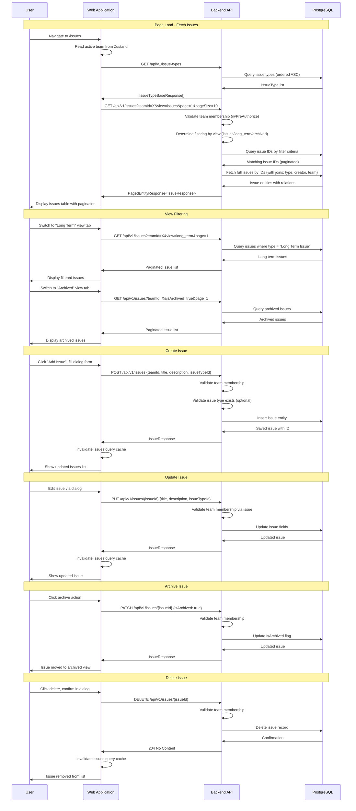

# Issues Tracking Flow

## Sequence Diagram

## Flow Description

1. **Page Initialization** - When the user navigates to `/issues`, the frontend fetches available issue types and the initial issues list for the active team. Issues are loaded with pagination support.

2. **Three-View Filtering** - Issues are organized into three views:
   - **Issues** - Active short-term issues (excluding "Long Term Issue" type)
   - **Long Term** - Issues specifically typed as "Long Term Issue"
   - **Archived** - All archived issues regardless of type

3. **Optimized Query Pattern** - The backend uses a two-step query: first fetching matching issue IDs with filters (lightweight query), then loading full issue entities by those IDs with eager joins. This avoids N+1 problems and keeps pagination efficient.

4. **Issue Creation** - Users create issues via a dialog form with title, optional description, and optional issue type. The backend validates team membership before persisting. The creator is automatically set from the JWT token.

5. **Issue Updates** - Issues can be edited to change title, description, or issue type. The backend verifies the requesting user belongs to the issue's team.

6. **Archiving** - Issues support soft-delete via archiving. Archived issues are hidden from the default view but remain accessible in the "Archived" tab.

7. **Hard Delete** - Issues can also be permanently deleted, which removes the record from the database entirely. A confirmation dialog is shown before deletion.

8. **Pagination** - All issue views support server-side pagination with configurable page size, sort field, and sort direction.
