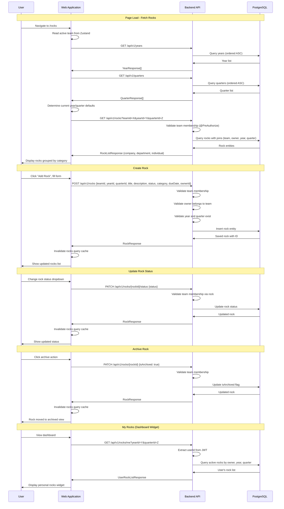

# Rocks (Quarterly Goals) Flow

## Sequence Diagram

## Flow Description

1. **Page Initialization** - When the user navigates to `/rocks`, the frontend reads the active team from the Zustand store, then fetches years and quarters to populate the selector dropdowns.

2. **Year/Quarter Selection** - The `useYearQuarterDefaults` hook determines the current year and quarter. The user can switch to view historical data using the `YearQuarterSelector` component.

3. **Rocks Fetching** - Rocks are fetched filtered by team, year, and quarter. The backend validates that the requesting user belongs to the team via `@PreAuthorize` and `TeamSecurityService`. Results are returned grouped by category (Company, Department, Individual).

4. **Rock Creation** - The user fills out a dialog form with title, description, category, status, owner, due date, year, and quarter. The backend validates team membership for both the creator and the assigned owner before persisting.

5. **Status Updates** - Rock status can be updated independently (ON_TRACK, OFF_TRACK, COMPLETED, DEFERRED) via a dedicated PATCH endpoint for quick status changes without opening the full edit form.

6. **Full Rock Update** - The edit dialog allows modifying all rock fields. The backend re-validates ownership and team membership on each update.

7. **Archiving** - Rocks can be archived (soft delete) rather than permanently deleted. Archived rocks are hidden from the default view but accessible via an archive filter.

8. **Personal Rocks View** - The dashboard widget and "My Rocks" view show rocks assigned to the current user across all their teams, filtered by the current year and quarter.
