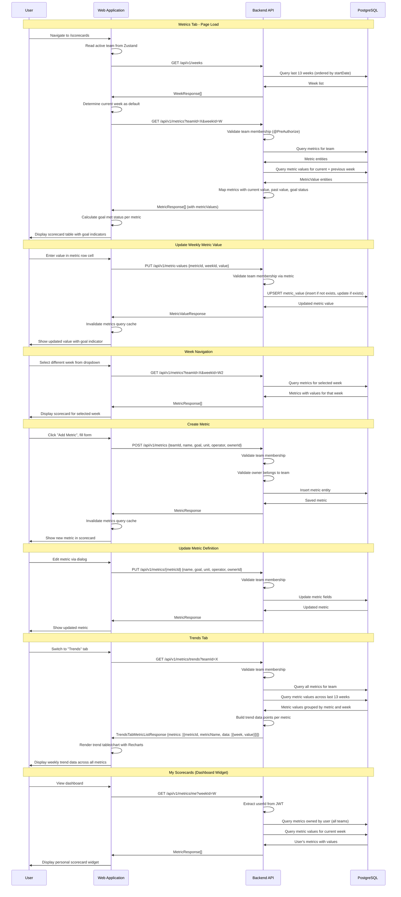

# Scorecard (Metrics & Trends) Flow

## Sequence Diagram

## Flow Description

1. **Metrics Tab Initialization** - The scorecards page loads available weeks (last 13) and fetches metrics for the active team and current week. Each metric shows its current value, previous week's value, goal, and whether the goal was met.

2. **Week Selection** - Users can navigate between weeks using a dropdown. The last 13 weeks are available, auto-generated by a background scheduler that runs every Monday at 00:01.

3. **Metric Value Entry** - Users enter weekly values directly in the scorecard table. The backend uses an UPSERT pattern (insert if not exists, update if exists) to handle metric values efficiently.

4. **Goal Status Calculation** - Each metric has a goal value and an operator (>=, <=, =, >, <). The goal-met status is calculated by comparing the entered value against the goal using the configured operator. The UI shows green/red indicators.

5. **Multiple Unit Types** - Metrics support five unit types: NUMBER, PERCENTAGE, CURRENCY, YES_NO, and RYG_STATUS (Red/Yellow/Green). The frontend formats values appropriately for each type.

6. **Metric Creation** - New metrics are created with a name, goal, unit type, comparison operator, and assigned owner. The owner must be a member of the team.

7. **Metric Editing** - Metric definitions (name, goal, unit, operator, owner) can be updated without affecting historical values.

8. **Trends Tab** - The trends view shows all team metrics across the last 13 weeks in a tabular/chart format. Data is fetched via a dedicated endpoint that returns pre-grouped trend data points.

9. **Personal Scorecards Widget** - The dashboard shows metrics assigned to the current user with their current week values, providing a quick personal KPI overview.

10. **Background Week Creation** - The `WeekCreationScheduler` runs every Monday at 00:01 to automatically create new week entries (Monday-Sunday range), ensuring the scorecard always has current week slots available.
