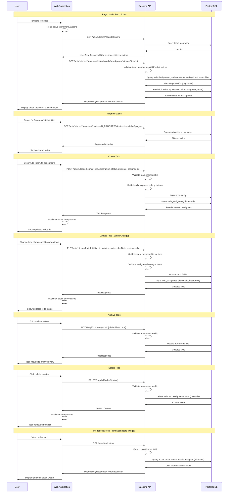

# Todos (Task Management) Flow

## Sequence Diagram

## Flow Description

1. **Page Initialization** - When the user navigates to `/todos`, the frontend loads team members (for the assignee selector/filter) and the initial todos list for the active team.

2. **Status Filtering** - Todos can be filtered by status: NOT_STARTED, IN_PROGRESS, or COMPLETED. The filter is applied server-side for accurate pagination.

3. **Two-Step Query Pattern** - Like issues, todos use an optimized query pattern: first fetching matching IDs with filters, then loading full entities with eager joins to avoid N+1 problems.

4. **Multi-Assignee Support** - Todos support multiple assignees via a many-to-many join table (`todo_assignees`). The assignee selector allows picking multiple team members.

5. **Todo Creation** - Users create todos with title, optional description, status (defaults to NOT_STARTED), optional due date, and optional assignee list. All assignees must belong to the same team.

6. **Status Workflow** - Todos follow a simple status workflow: NOT_STARTED → IN_PROGRESS → COMPLETED. Status can be changed via the table inline controls or the edit dialog.

7. **Assignee Synchronization** - When updating a todo's assignees, the backend performs a full sync: deletes all existing assignee records and inserts the new set. This ensures the assignee list is always consistent.

8. **Archiving vs Deletion** - Todos support both soft-delete (archive) and hard-delete. Archiving preserves the todo for historical reference, while deletion permanently removes it.

9. **Cross-Team Personal View** - The dashboard widget shows todos assigned to the current user across all their teams, providing a unified personal task list.
